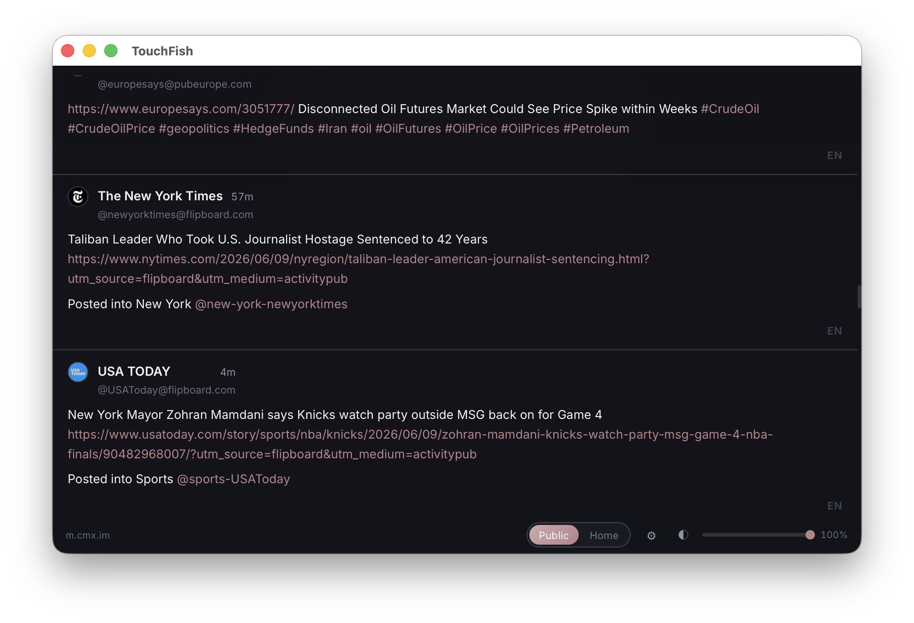
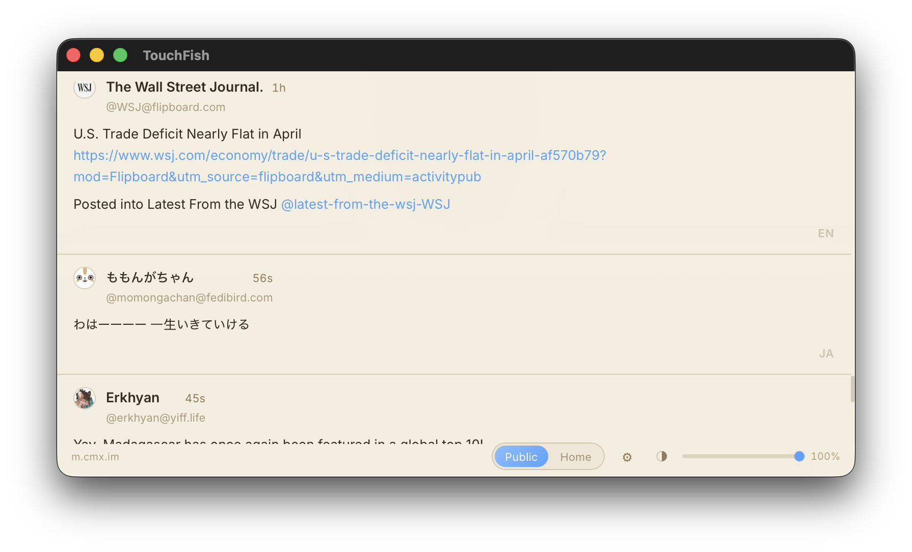

# TouchFish

[中文](./README.md) | [English](./README.en.md) | [日本語](./README.ja.md)

`TouchFish` 是一个为 Mastodon 设计的摸鱼阅读器。

深色模式示意图


浅色模式示意图



## 这个应用可以干嘛

这是一个适合悄悄看时间线的 Mastodon 阅读器。

- 不显眼：界面更轻，更像一个小工具窗，不像完整社交网站那样张扬。
- 更有隐私性：不会像普通网页那样把头像、昵称、侧边栏和各种社交元素大面积展示出来。
- 键盘优先：适合喜欢 Vim 风格操作的人，基本不用频繁切鼠标。
- 一键开关：最重要的一点，支持全局快捷键快速显示 / 隐藏窗口，需要时秒开，不需要时秒关。

## 适合 Vim 用户的操作方式

默认支持这些阅读操作：

- `j` / `k`：向下 / 向上滚动
- `u` / `d`：向上 / 向下翻半页
- `gg`：回到顶部
- `G`：跳到最底部
- `r`：刷新时间线

## 一键开关

这个应用支持全局快捷键一键开关。

默认快捷键是：

```text
CommandOrControl + D
```


## 如何填写实例地址和 Token

第一次使用时，你需要在设置里填写：

- `实例地址`
- `Access Token`

### 实例地址怎么填

填你自己的 Mastodon 实例地址，比如：

```text
https://mastodon.social
```

如果你输入的是不带 `https://` 的地址，应用也会自动帮你补全。

### Token 是什么

`Access Token` 可以理解成“允许这个应用读取你时间线的一把钥匙”。

这个应用目前主要用它来读取你的 `Home` 时间线，不会要求你在这里重新登录网页。

### Token 获取步骤

1. 打开你自己的 Mastodon 实例，并登录账号
2. 进入：

```text
Preferences -> Development -> New Application
```

3. 新建一个应用
4. 给应用起个名字，比如 `TouchFish`
5. 在 `Scopes` 里至少勾选 `read`
6. 创建完成后，打开这个应用的详情页
7. 复制里面的 `Access Token`
8. 回到 TouchFish，把它粘贴进设置里的 `Access Token`

填好以后，就可以切到 `Home` 时间线了。

## 多语言

当前界面支持：

- 中文
- English
- 日本語

你可以在设置页里切换界面语言。
